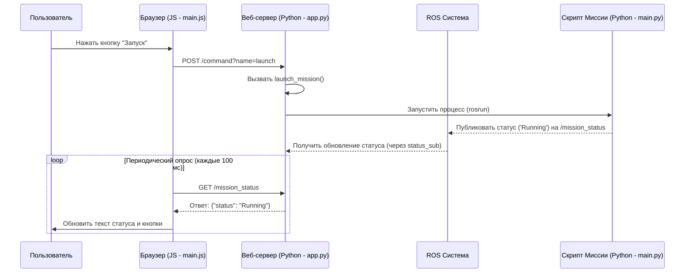

# Chapter 1: Веб-панель управления


Добро пожаловать в руководство по проекту `fr-team-task-rozen`! В этой первой главе мы познакомимся с важной частью системы – веб-панелью управления.

Представьте, что вы управляете сложным роботом, например, дроном, выполняющим миссию. Как узнать, что он делает прямо сейчас? Заряжена ли батарея? Где он находится? Как отдать ему команду остановиться или вернуться домой? Вам нужен удобный "пульт управления". Веб-панель управления – это именно такой пульт, доступный прямо в вашем браузере.

**Зачем нужна веб-панель?**

Основная задача веб-панели – предоставить **простой и наглядный способ взаимодействия** с дроном. Вместо сложных команд в терминале или специализированного ПО, вы можете просто открыть веб-страницу и получить всю нужную информацию и кнопки управления.

Это похоже на приборную панель автомобиля:
*   **Отображает информацию:** Скорость, уровень топлива, температуру двигателя (в нашем случае – статус миссии, заряд батареи, карту с объектами).
*   **Предоставляет управление:** Руль, педали, кнопки (в нашем случае – кнопки "Старт", "Стоп", "Пауза", "Посадка").

Панель связывает пользователя (оператора) с системой управления дроном.

**Из чего состоит веб-панель?**

Наша веб-панель – это веб-приложение, состоящее из двух основных частей:

1.  **Фронтенд (Клиентская часть):** То, что вы видите и с чем взаимодействуете в браузере. Это веб-страница, созданная с использованием HTML (структура), CSS (стили) и JavaScript (интерактивность). Файлы `main.js`, `buildings_list.js`, `aruco.js` в папке `offboard/app/static/` отвечают за отображение данных (карты, статуса, списка объектов) и отправку команд на сервер.
2.  **Бэкенд (Серверная часть):** "Мозг" панели управления, работающий на компьютере, подключенном к дрону (или в симуляции). Он написан на Python с использованием фреймворка **Flask** (файл `app.py`). Бэкенд выполняет две ключевые роли:
    *   Обслуживает фронтенд: Отдает браузеру файлы HTML, CSS, JavaScript при запросе страницы.
    *   Выступает посредником: Принимает команды от фронтенда (например, "нажми кнопку Старт") и передает их системе управления дроном через ROS. Также получает данные от системы (статус, заряд батареи) и передает их фронтенду для отображения.

**Как это работает вместе?**

*   **Браузер (Фронтенд) <-> Веб-сервер (Бэкенд):** Они общаются с помощью стандартных веб-протоколов (HTTP). Когда вы нажимаете кнопку, JavaScript отправляет HTTP-запрос на бэкенд. Когда бэкенду нужно обновить данные на странице, он отправляет их в ответ на запросы от JavaScript.
*   **Веб-сервер (Бэкенд) <-> Система Дрона (ROS):** Бэкенд "живет" в той же среде, что и остальное программное обеспечение дрона, и использует **ROS (Robot Operating System)** для общения. Он подписывается на *топики* ROS для получения данных (например, `/mission_status`, `/mavros/battery`) и вызывает *сервисы* ROS для отправки команд (например, `/mission_shutdown`, `/mission_land`). Подробнее о том, как дрон управляется и меняет свои состояния, мы поговорим в главах [Машина состояний миссии](02_машина_состояний_миссии_.md) и [Абстракция управления дроном (Offboard)](04_абстракция_управления_дроном__offboard__.md).
*   **Браузер (Фронтенд) <-> Система Дрона (ROS) (через ROS Bridge):** Для некоторых вещей, например, отображения карты в реальном времени, JavaScript в браузере может напрямую подписываться на топики ROS с помощью библиотеки `ROSLIB.js`. Это возможно благодаря компоненту `rosbridge_server`, который "переводит" веб-запросы в сообщения ROS и обратно.

**Как использовать панель?**

1.  **Запуск:** Сначала нужно запустить сам веб-сервер. Обычно это делается командой в терминале в папке проекта. Сервер сообщит, по какому адресу (например, `http://localhost:8000`) теперь доступна панель.
2.  **Открытие в браузере:** Вы просто открываете этот адрес в вашем веб-браузере.
3.  **Мониторинг:** На странице вы увидите:
    *   Текущий статус миссии (например, "NotRunning", "Running", "Paused").
    *   Уровень заряда батареи (напряжение и процент).
    *   Карту, на которой могут отображаться обнаруженные объекты (здания, маркеры ArUco). О том, как происходит обнаружение, читайте в главе [Обработка видеопотока и обнаружение объектов](03_обработка_видеопотока_и_обнаружение_объектов_.md).
4.  **Управление:** На панели есть кнопки:
    *   **Запуск (Launch):** Запускает основную миссию дрона.
    *   **Стоп (Stop):** Прекращает миссию (используется только когда миссия активна или на паузе). *В коде эта кнопка названа 'Shutdown', но часто означает полную остановку миссии.*
    *   **Пауза/Продолжить (Pause/Resume):** Приостанавливает выполнение миссии / Возобновляет выполнение.
    *   **Обезоружить (Disarm):** Отключает моторы дрона (используется для безопасности, когда миссия не выполняется активно).
    *   **Посадка (Land):** Инициирует процедуру посадки (обычно доступно, когда миссия на паузе).

**Заглянем под капот: Пример работы**

Давайте посмотрим, что происходит, когда вы нажимаете кнопку "Запуск".

1.  **Клик:** Вы нажимаете кнопку "Запуск" в браузере.
2.  **JavaScript (Фронтенд):** Файл `main.js` содержит функцию `sendCommand`, которая вызывается при клике.

    ```javascript
    // --- Файл: offboard/app/static/main.js (упрощено) ---
    function sendCommand(cmd) {
        var req = new XMLHttpRequest();
        // Отправляем POST-запрос на сервер по адресу /command
        // Добавляем имя команды (например, 'launch') как параметр 'name'
        req.open('POST', "/command?name=" + cmd)
        req.send();
    }

    // Пример привязки к кнопке (HTML не показан)
    // document.getElementById('launch-btn').onclick = function() { sendCommand('launch'); };
    ```
    *Объяснение:* Этот код отправляет HTTP POST-запрос на адрес `/command` нашего веб-сервера. В адресе передается параметр `name` со значением `launch`, чтобы сервер понял, какую именно команду нужно выполнить.

3.  **Flask (Бэкенд):** Файл `app.py` получает этот запрос и обрабатывает его в функции, связанной с путем `/command`.

    ```python
    # --- Файл: offboard/app/app.py (упрощено) ---
    from flask import Flask, request
    # ... другие импорты ...
    import subprocess
    import time
    import threading

    app = Flask(__name__)
    # ... инициализация ROS и сервисов ...

    last_launch_time = -1
    launch_mutex = threading.Lock()
    def launch_mission():
        # Запускает основной скрипт миссии в отдельном процессе
        global launch_mutex, last_launch_time
        # ... (защита от слишком частых запусков) ...
        subprocess.Popen(["rosrun", "offboard", "main.py"])
        last_launch_time = time.time()
        # ...

    class MissionCommands(Enum): # Словарь команд
        Launch = partial(launch_mission) # Имя команды -> функция
        # ... другие команды (Stop, Pause, Land, Disarm) ...

    @app.route('/command', methods=['POST'])
    def command():
        name = request.args.get('name') # Получаем 'launch' из запроса
        for command in MissionCommands:
            if command.name.lower() == name:
                command.value() # Вызываем функцию launch_mission()
                return "", 201 # Успех
        return "", 404 # Команда не найдена
    ```
    *Объяснение:* Flask принимает POST-запрос на `/command`. Он извлекает параметр `name` (`launch`). Затем он ищет команду с таким именем в `MissionCommands` и вызывает связанную с ней функцию – `launch_mission()`. Эта функция использует `subprocess.Popen` для запуска основного скрипта миссии `main.py` (который содержит [Машина состояний миссии](02_машина_состояний_миссии_.md)).

4.  **Обновление статуса:**
    *   Запущенный скрипт `main.py` начинает работать и публиковать свой статус (например, "Running") в ROS-топик `/mission_status`.
    *   В `app.py` есть подписчик на этот топик:

        ```python
        # --- Файл: offboard/app/app.py ---
        status = 'NotRunning'
        def mission_status_cb(msg): # Функция вызывается при получении сообщения
            global status
            status = msg.data # Обновляем глобальную переменную status

        # Подписываемся на топик /mission_status
        status_sub = rospy.Subscriber("/mission_status", String, mission_status_cb)
        ```
        *Объяснение:* Бэкенд слушает топик `/mission_status`. Как только `main.py` публикует новый статус, функция `mission_status_cb` обновляет переменную `status`.

    *   Тем временем, JavaScript в браузере (`main.js`) периодически (каждые 100 мс) запрашивает у бэкенда текущий статус через другой маршрут – `/mission_status`.

        ```python
        # --- Файл: offboard/app/app.py ---
        @app.route('/mission_status', methods=['GET'])
        def mission_status():
            global status
            response = {'status': None}
            # Проверяем, запущен ли узел ROS миссии
            if '/offboard_node' not in rosnode.get_node_names():
                response['status'] = status = 'NotRunning' # Если нет, статус NotRunning
            else:
                response['status'] = status # Иначе, возвращаем текущий статус
            return jsonify(response) # Отправляем статус в формате JSON
        ```

        ```javascript
        // --- Файл: offboard/app/static/main.js ---
        setInterval(() => { // Выполняется каждые 100 миллисекунд
            const url = "/mission_status";
            fetch(url) // Отправляем GET-запрос на /mission_status
                .then(function (response) { return response.json(); })
                .then(function (mission) { // Получаем ответ {status: "..."}
                    // Обновляем текст на странице и состояние кнопок
                    document.getElementById('mission-status').textContent = `Mission Status: ${mission.status}`;
                    // ... (логика включения/выключения кнопок) ...
                });
        }, 100);
        ```
        *Объяснение:* JavaScript регулярно "спрашивает" бэкенд (`GET /mission_status`), какой сейчас статус. Бэкенд возвращает значение своей переменной `status`. JavaScript получает этот статус и обновляет текст на веб-странице, а также включает/выключает кнопки в зависимости от текущего состояния миссии.

**Диаграмма взаимодействия (при нажатии "Старт"):**



**Отображение данных с ROS (Карта, Батарея)**

Помимо статуса, панель отображает и другие данные из ROS:

*   **Батарея:** `main.js` подписывается напрямую (через ROS Bridge и `ROSLIB.js`) на топик `/mavros/battery`, чтобы получать данные о напряжении и проценте заряда.

    ```javascript
    // --- Файл: offboard/app/static/main.js ---
    const voltageTopic = new ROSLIB.Topic({
        ros: ros, // Объект подключения к ROS Bridge
        name: '/mavros/battery',
        messageType: 'sensor_msgs/BatteryState'
    });

    voltageTopic.subscribe((message) => {
        // Обновляем элементы на странице с данными батареи
        document.getElementById('voltage').textContent = `Voltage: ${message.voltage.toFixed(2)}V`;
        document.getElementById('percentage').textContent = `${(message.percentage * 100).toFixed(2)}%`;
    });
    ```

*   **Карта и Объекты:** `main.js` также подписывается на топики `/buildings` и `/aruco_map/map` (которые публикуются модулем [Обработка видеопотока и обнаружение объектов](03_обработка_видеопотока_и_обнаружение_объектов_.md)). Получив данные о положении и типе объектов, JavaScript использует библиотеку `ROS2D.js` для их отрисовки на `<canvas>` элементе HTML, создавая интерактивную карту. Вспомогательные скрипты `aruco.js` и `buildings_list.js` помогают в отрисовке маркеров и списка зданий.

**Заключение**

Веб-панель управления – это удобный интерфейс для мониторинга и контроля миссии дрона. Она использует связку из фронтенда (HTML/CSS/JS в браузере) и бэкенда (Flask на Python), которые взаимодействуют через HTTP. Бэкенд, в свою очередь, общается с основной системой управления дроном с помощью ROS (топики и сервисы). Это позволяет оператору легко следить за состоянием дрона и отдавать ему базовые команды.

В следующей главе мы подробно разберем, как устроена логика самой миссии – [Машина состояний миссии](02_машина_состояний_миссии_.md).

---

Generated by [AI Codebase Knowledge Builder](https://github.com/The-Pocket/Tutorial-Codebase-Knowledge)