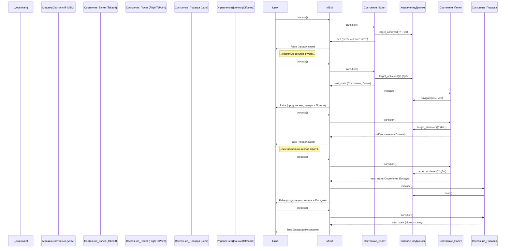

# Chapter 2: Машина состояний миссии


В [предыдущей главе](01_веб_панель_управления_.md) мы познакомились с [Веб-панелью управления](01_веб_панель_управления_.md), которая позволяет нам следить за дроном и отдавать ему команды. Но кто решает, *что именно* дрон должен делать после нажатия кнопки "Старт"? Как дрон понимает, что сначала нужно взлететь, потом лететь по маршруту, а затем приземлиться? За эту логику отвечает **Машина состояний миссии**.

**Зачем нужна Машина состояний?**

Представьте, что вы пишете сценарий для дрона. Сценарий состоит из последовательных действий:

1.  Взлететь на высоту 1 метр.
2.  Подождать 2 секунды.
3.  Пролететь в точку (2 метра вперед, 0 метров вбок).
4.  Подождать 2 секунды.
5.  Вернуться в точку старта (0, 0).
6.  Приземлиться.

Дрон не может выполнять все эти действия одновременно. Он всегда находится в каком-то *одном* состоянии: "Взлетает", "Летит к точке А", "Ожидает", "Приземляется" и так далее. Машина состояний – это как раз механизм, который:

*   **Определяет все возможные состояния** дрона во время миссии.
*   **Управляет переходами** между этими состояниями. Дрон переходит из одного состояния в другое только тогда, когда выполнено определенное условие (например, достиг нужной точки, прошло заданное время).

Это похоже на светофор: он может быть в состоянии "Красный", "Желтый" или "Зеленый". Он переключается между этими состояниями по определенным правилам (прошло время). Машина состояний миссии работает по схожему принципу, но состояний и правил перехода может быть гораздо больше.

**Основные понятия**

1.  **Состояние (State):** Конкретное действие или режим работы, в котором находится дрон в данный момент. Примеры: `Взлет`, `ПолетКТочке`, `Ожидание`, `Посадка`.
2.  **Переход (Transition):** Условие или событие, которое вызывает смену состояния. Например: "достиг целевой точки", "прошло N секунд", "получена команда Пауза".
3.  **Машина состояний (State Machine):** Объект, который хранит текущее состояние и решает, когда и в какое следующее состояние нужно перейти.

**Как это работает в нашем проекте?**

В файле `offboard/scripts/main.py` (и его упрощенной версии `mission.py`) реализована эта логика. Давайте разберем ключевые части.

**1. Базовый класс для всех состояний (`IState`)**

Чтобы все состояния вели себя единообразно, есть базовый класс `IState`. Он определяет общий "интерфейс" для всех состояний.

```python
# --- Файл: offboard/scripts/main.py (сильно упрощено) ---
from abc import ABC, abstractmethod

class IState(ABC):
    def __init__(self, machine):
        self.__machine = machine # Ссылка на главную машину состояний
        self.__next_state = None # Какое состояние будет следующим?
        self.__initialised = False # Было ли состояние инициализировано?
        # ... (пропустим post_function для простоты)

    # Указывает, какое состояние будет следующим после завершения текущего
    def next(self, next_state):
        self.__next_state = next_state
        return self

    # Этот метод вызывается один раз при входе в состояние
    @abstractmethod
    def initialise(self):
        print(f"Вход в состояние: {type(self).__name__}")
        self.__initialised = True
        return self

    # Этот метод вызывается многократно, пока дрон находится в этом состоянии.
    # Он проверяет, пора ли переходить в следующее состояние.
    # Возвращает: self (остаемся в этом состоянии) или следующее состояние.
    @abstractmethod
    def transition(self):
        # Если условие для перехода выполнено:
        if self.__next_state is None:
            return None # Миссия завершена

        # Инициализируем следующее состояние, если оно еще не было
        if not self.__next_state.initialised:
             self.__next_state.initialise()
        return self.__next_state # Переходим в следующее состояние

    @property
    def machine(self): # Позволяет получить доступ к 'machine' из состояния
        return self.__machine

    @property
    def initialised(self) -> bool: # Проверка, инициализировано ли состояние
        return self.__initialised
```

*Объяснение:*
*   `IState` - это шаблон (абстрактный класс). Каждое конкретное состояние (как `Takeoff` или `FlightToPoint`) будет наследовать от него.
*   `__init__`: Сохраняет ссылку на главную машину (`machine`), чтобы состояние могло взаимодействовать с дроном (например, вызывать `machine.offboard.navigate(...)`).
*   `next()`: Позволяет выстраивать цепочку состояний: `СостояниеА.next(СостояниеБ).next(СостояниеВ)`.
*   `initialise()`: Вызывается *один раз* при активации состояния. Здесь обычно отдается команда дрону (например, "начать взлет").
*   `transition()`: Вызывается *много раз* в цикле. Проверяет, завершилось ли действие (например, "дрон достиг высоты взлета?"). Если да, возвращает следующее состояние из цепочки (`__next_state`). Если нет, возвращает `self` (остаемся в текущем состоянии).

**2. Конкретные состояния**

Теперь создадим классы для наших действий, наследуя `IState`.

```python
# --- Файл: offboard/scripts/main.py (сильно упрощено) ---

# Состояние: Взлет
class Takeoff(IState):
    def initialise(self):
        # Отдаем команду взлететь (не блокирующая)
        self.machine.offboard.nonblock_takeoff()
        return super().initialise() # Вызываем initialise базового класса

    def transition(self):
        # Проверяем, достиг ли дрон нужной высоты
        if self.machine.offboard.target_achieved():
            print("Взлет завершен!")
            return super().transition() # Переходим к следующему состоянию
        return self # Остаемся в состоянии взлета

# Состояние: Полет к точке
class FlightToPoint(IState):
    def __init__(self, machine, x: float, y: float, z: float = None):
        super().__init__(machine)
        self.__x = x
        self.__y = y
        self.__z = z # Если Z не указан, используется высота по умолчанию

    def initialise(self):
        # Отдаем команду лететь к точке (не блокирующая)
        # Используем систему координат 'aruco_map' (связана с картой)
        self.machine.offboard.navigate(x=self.__x, y=self.__y, z=self.__z, frame_id='aruco_map')
        return super().initialise()

    def transition(self):
        # Проверяем, достиг ли дрон точки
        if self.machine.offboard.target_achieved():
            print(f"Достигли точки ({self.__x}, {self.__y})")
            return super().transition() # Переходим к следующему состоянию
        return self # Остаемся в состоянии полета к точке

# Состояние: Посадка
class Land(IState):
    def initialise(self):
        # Отдаем команду на посадку
        self.machine.offboard.land()
        # Для посадки нет условия завершения, переход происходит сразу
        return super().initialise()

    def transition(self):
        # Сразу переходим к следующему состоянию (или завершаем миссию)
        print("Посадка инициирована.")
        return super().transition()

# Состояние: Ожидание (просто пауза)
class WaitFor(IState):
    def __init__(self, time_sec: float):
        # Обратите внимание: не принимает 'machine', т.к. не управляет дроном
        super().__init__(None)
        self.__duration = rospy.Duration(time_sec) # Время ожидания в секундах
        self.__finish_time = None

    def initialise(self):
        print(f"Ожидание {self.__duration.to_sec()} секунд...")
        self.__finish_time = rospy.Time.now() + self.__duration
        return super().initialise()

    def transition(self):
        # Проверяем, прошло ли время
        if rospy.Time.now() >= self.__finish_time:
            print("Ожидание завершено.")
            return super().transition() # Переходим к следующему состоянию
        return self # Остаемся в состоянии ожидания
```

*Объяснение:*
*   Каждый класс (`Takeoff`, `FlightToPoint`, `Land`, `WaitFor`) реализует логику одного конкретного этапа миссии.
*   В `initialise()` они отдают соответствующую команду дрону через `self.machine.offboard` (об этом подробнее в главе [Абстракция управления дроном (Offboard)](04_абстракция_управления_дроном__offboard__.md)). Команды `nonblock_takeoff` и `navigate` *не ждут* завершения, они просто отправляют команду и позволяют машине состояний работать дальше.
*   В `transition()` они проверяют условие завершения этого этапа (например, `target_achieved()` для полета). Если условие выполнено, вызывается `super().transition()`, который возвращает следующее состояние из цепочки, заданной через `.next()`.

**3. Машина состояний (`MissionStateMachine`)**

Это главный класс, который управляет всем процессом. Он хранит текущее состояние и в цикле вызывает его метод `transition()`.

```python
# --- Файл: offboard/scripts/main.py (сильно упрощено) ---
import rospy
import threading
from std_msgs.msg import String
from std_srvs.srv import Trigger, TriggerResponse
from enum import Enum

# (Пропустим импорты Offboard, VideoHandler, ProbabilityMap и т.д.)
# (Пропустим конкретные классы состояний, показанные выше)

class MissionStateMachine(object):
    # Возможные статусы миссии для веб-панели
    class MissionStatus(Enum):
        NOTRUNNING = "NotRunning"
        RUNNING = "Running"
        PAUSED = "Paused"
        HOMING = "Homing" # Возвращение домой
        LANDING = 'Landing' # Посадка по команде
        # ... (DISARMING пропущен для простоты)

    def __init__(self, flight_height, flyzone_dimensions, debug_mode):
        # Сохраняем параметры
        self.flight_height = flight_height
        self.flyzone_dimensions = flyzone_dimensions

        # Создаем объекты для управления дроном и обработки видео
        self.offboard = Offboard(flight_height) # Управление полетом
        self.video_handler = VideoHandler(...)   # Обработка видео (см. Главу 3)
        # ... (VideoRecorder пропущен)

        # --- Управление через веб-панель (ROS Сервисы) ---
        # (Пропустим детали регистрации сервисов /mission_shutdown, /mission_pause и т.д.)
        # Они будут менять состояние машины (__current_state, __pause, __returning_to_home)

        # Публикатор статуса для веб-панели
        self.__status_publisher = rospy.Publisher('/mission_status', String, queue_size=1)

        # Переменные для управления состоянием
        self.__mutex = threading.Lock() # Для безопасности в многопоточной среде
        self.__pause = False            # Флаг паузы
        self.__returning_to_home = False # Флаг возвращения домой
        self.__status = self.MissionStatus.RUNNING.value # Начальный статус

        # --- Определение последовательности миссии ---
        # Создаем цепочку состояний с помощью .next()
        self.__current_state = Takeoff(self).next(           # 1. Взлететь
            WaitFor(2.0).next(                              # 2. Подождать 2 сек
            FlightToPoint(self, 2, 0).next(                 # 3. Лететь в (2, 0)
            WaitFor(2.0).next(                              # 4. Подождать 2 сек
            FlightToPoint(self, 0, 0).next(                 # 5. Лететь в (0, 0) - домой
            Land(self)                                      # 6. Приземлиться
        )))))).initialise() # Инициализируем *первое* состояние (Takeoff)

    # ... (Пропустим методы __shutdown_response, __pause_response и т.д.)

    # Главный метод, вызываемый в цикле
    def process(self) -> bool: # Возвращает True, если миссия завершена
        self.__mutex.acquire() # Блокируем доступ для других потоков

        # Публикуем текущий статус для веб-панели
        self.__status_publisher.publish(String(data=self.__status))

        # Если текущего состояния нет (миссия завершена)
        if self.__current_state is None:
            print("Миссия завершена.")
            self.__status = self.MissionStatus.NOTRUNNING.value
            self.__status_publisher.publish(String(data=self.__status))
            self.__mutex.release()
            return True # Сигнал для остановки цикла

        # Если включена пауза, ничего не делаем
        if self.__pause:
            # Статус уже установлен в PAUSED в __pause_response
            self.__mutex.release()
            return False # Миссия не завершена, продолжаем цикл

        # --- САМОЕ ГЛАВНОЕ: Переход состояния ---
        # Вызываем transition() текущего состояния.
        # Оно вернет либо себя же (если действие не закончено),
        # либо следующее состояние (если действие закончено).
        self.__current_state = self.__current_state.transition()
        # -----------------------------------------

        self.__mutex.release() # Освобождаем доступ
        return False # Миссия не завершена, продолжаем цикл

# --- Основная функция запуска ---
def main() -> None:
    rospy.init_node('offboard_node') # Инициализация узла ROS

    # Параметры миссии (для примера)
    FLIGHT_HEIGHT = 1.0
    FLYZONE_DIMENSIONS = [7, 4] # Размеры зоны полета (для MapBypass)
    DEBUG_MODE = True

    # Создаем машину состояний
    state_machine = MissionStateMachine(FLIGHT_HEIGHT,
                                        FLYZONE_DIMENSIONS,
                                        DEBUG_MODE)

    # Главный цикл: выполняется, пока ROS работает и миссия не завершена
    while not rospy.is_shutdown() and not state_machine.process():
        rospy.sleep(0.1) # Небольшая пауза, чтобы не загружать процессор

if __name__ == '__main__':
    main()
```

*Объяснение:*
*   `__init__`: Создает все необходимые компоненты (`Offboard`, `VideoHandler`), настраивает переменные состояния (`__pause`, `__status`) и, самое главное, определяет *сценарий миссии*, связывая состояния в цепочку с помощью `next()` и сохраняя первое состояние в `self.__current_state`. Затем вызывается `initialise()` первого состояния.
*   `process()`: Это сердце машины состояний. Оно вызывается снова и снова в цикле `while` функции `main`.
    *   Публикует текущий статус (`__status`) в ROS-топик `/mission_status`, чтобы [Веб-панель управления](01_веб_панель_управления_.md) могла его отобразить.
    *   Проверяет, не завершена ли миссия (`__current_state is None`) или не включена ли пауза (`__pause`).
    *   **Вызывает `transition()` текущего состояния.** Это ключевой момент! Метод `transition` внутри состояния решает, нужно ли переходить дальше.
    *   Обновляет `self.__current_state` тем, что вернул `transition()`. Если действие завершено, `__current_state` теперь будет указывать на следующее состояние в цепочке. Если нет, `__current_state` останется прежним.
*   `main()`: Инициализирует ROS, создает `MissionStateMachine` и запускает основной цикл, который вызывает `process()` до тех пор, пока миссия не завершится или узел ROS не будет остановлен.

**Диаграмма выполнения простого сценария**

Давайте посмотрим, как машина состояний выполнит сценарий "Взлет -> Полет к (2,0) -> Посадка".



**Более сложный сценарий: Обход территории (`MapBypass`)**

В реальной миссии дрон должен облететь заданную территорию, например, по траектории "зигзаг". Для этого есть специальное состояние `MapBypass`.

```python
# --- Файл: offboard/scripts/main.py (упрощено) ---

# Класс для генерации точек маршрута "зигзаг"
class ZigzagPlanner(Planner):
    def __init__(self, area_x: float, area_y: float, bypass_number: int):
        # ... (реализация генератора точек) ...
        pass
    def path(self):
        # yield (x1, y1)
        # yield (x2, y2)
        # ...
        pass # Этот метод возвращает координаты точек одну за другой

# Состояние: Обход карты по маршруту
class MapBypass(IState):
    def initialise(self):
        # Создаем итератор по точкам маршрута
        self.__iter = iter(ZigzagPlanner(*self.machine.flyzone_dimensions, bypass_number=7).path())
        # Включаем обработку видео (чтобы искать объекты во время полета)
        self.machine.video_handler.enable()
        return super().initialise()

    def transition(self):
        try:
            # Пытаемся получить следующую точку из маршрута
            x, y = next(self.__iter)
        except StopIteration:
            # Если точки закончились - обход завершен
            print("Обход территории завершен.")
            self.machine.video_handler.disable() # Выключаем обработку видео
            return super().transition() # Переходим к следующему состоянию

        # Если точка есть, создаем *временную* под-цепочку состояний:
        # 1. Лететь к этой точке
        # 2. Подождать там 1 секунду
        # 3. Вернуться обратно в состояние MapBypass (чтобы взять следующую точку)
        next_step = FlightToPoint(self.machine, x, y).next(
                        WaitFor(1.0).next(
                            self # Возвращаемся сюда же!
                    )).initialise()
        return next_step # Переходим к полету к точке
```

*Объяснение:*
*   `MapBypass` использует `ZigzagPlanner` для получения координат точек маршрута.
*   При первом входе (`initialise`) он создает итератор по этим точкам и включает обработку видео ([подробнее в следующей главе](03_обработка_видеопотока_и_обнаружение_объектов_.md)).
*   В `transition()` он берет следующую точку (`next(self.__iter)`).
*   Если точки закончились (`StopIteration`), обход завершен, и он переходит к следующему состоянию в основной цепочке (например, к `FlightToPoint(0, 0)` для возврата домой).
*   Если точка есть, он *динамически создает* временную цепочку состояний: `FlightToPoint` -> `WaitFor` -> `MapBypass`. Он переходит в `FlightToPoint`. Когда полет и ожидание завершатся, машина состояний вернется обратно в `MapBypass.transition()`, чтобы взять следующую точку зигзага.
*   Это показывает гибкость машины состояний: состояния могут создавать и запускать другие последовательности состояний.

**Управление извне (Пауза, Стоп)**

Как [Веб-панель управления](01_веб_панель_управления_.md) может поставить миссию на паузу или остановить? Она вызывает ROS-сервисы (`/mission_pause`, `/mission_shutdown`), которые обрабатываются в `MissionStateMachine` (методы `__pause_response`, `__shutdown_response` и т.д., пропущенные выше для простоты).

*   **Пауза (`__pause_response`):**
    *   Устанавливает флаг `self.__pause = True`.
    *   Устанавливает статус `self.__status = self.MissionStatus.PAUSED.value`.
    *   Создает и *немедленно* инициализирует специальное состояние `HoldCurrentPosition`, которое просто командует дрону оставаться на месте. Это важно, чтобы дрон завис в воздухе, а не продолжил лететь по инерции.
    *   Когда пауза снимается, флаг `self.__pause` сбрасывается, статус меняется на `RUNNING`, и *предыдущее* состояние (которое было до паузы) снова инициализируется (`self.__current_state.initialise()`), чтобы продолжить выполнение с того же места.
*   **Стоп/Возврат домой (`__shutdown_response`):**
    *   Устанавливает флаг `self.__returning_to_home = True`.
    *   Устанавливает статус `self.__status = self.MissionStatus.HOMING.value`.
    *   Полностью **перезаписывает** текущую цепочку состояний (`self.__current_state`) новой цепочкой: `FlightToPoint(0, 0)` -> `FlightToPoint(0, 0, height/2)` -> `Land()`. Это гарантирует, что дрон полетит домой и сядет, игнорируя оставшуюся часть исходного плана.

**Заключение**

Машина состояний миссии – это мощный и гибкий способ управления поведением дрона. Она разбивает сложную миссию на простые, управляемые шаги (состояния) и контролирует переходы между ними на основе заданных условий.

Ключевые идеи:
*   **Состояния:** Определяют, что дрон делает *сейчас*.
*   **Переходы:** Определяют, *когда* переключаться на следующее действие.
*   **Машина состояний:** Оркеструет весь процесс, вызывает методы состояний и управляет сменой текущего состояния.
*   **Гибкость:** Позволяет легко менять сценарий миссии, добавлять новые шаги и обрабатывать внешние команды (пауза, стоп).

В этой главе мы увидели, как машина состояний управляет *последовательностью* действий дрона. В следующей главе, [Обработка видеопотока и обнаружение объектов](03_обработка_видеопотока_и_обнаружение_объектов_.md), мы узнаем, как дрон "видит" окружающий мир и находит нужные объекты во время полета.

---

Generated by [AI Codebase Knowledge Builder](https://github.com/The-Pocket/Tutorial-Codebase-Knowledge)