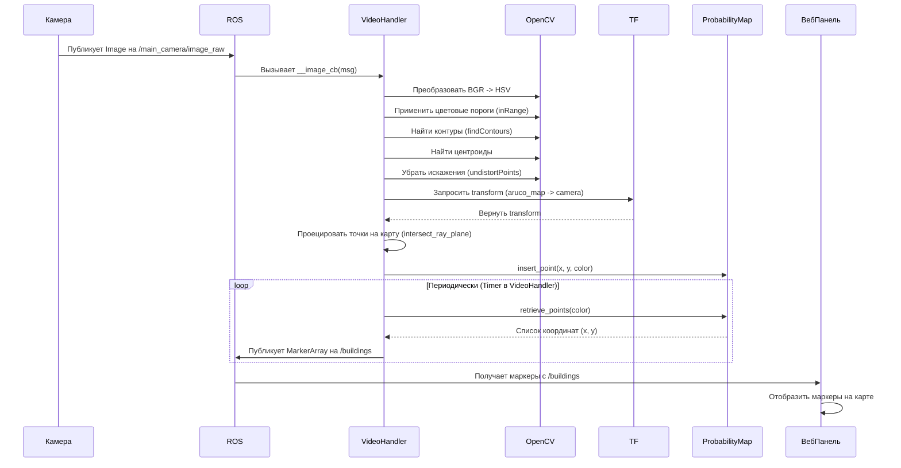

# Chapter 3: Обработка видеопотока и обнаружение объектов


В [предыдущей главе](02_машина_состояний_миссии_.md) мы разобрались, как [Машина состояний миссии](02_машина_состояний_миссии_.md) управляет последовательностью действий дрона, словно режиссер, говорящий "Мотор! Камера! Снято!". Но чтобы дрон мог осмысленно выполнять миссию в реальном мире, ему нужно "видеть" и понимать, что происходит вокруг. В этой главе мы узнаем, как дрон обретает зрение и находит важные объекты на земле.

**Зачем дрону "глаза"?**

Представьте нашу миссию: дрон должен облететь территорию и найти цветные метки на земле, которые обозначают разные типы зданий (административное, лаборатория и т.д.). Как он их найдет? Ему нужны "глаза" – камера, и "зрительная кора" – программный модуль, который анализирует изображение с камеры.

Именно эту задачу решает система **обработки видеопотока и обнаружения объектов**. Она непрерывно получает картинку с камеры дрона, ищет на ней заданные цветные пятна и определяет, где они находятся в реальном мире (на карте).

**Ключевые компоненты "зрения" дрона:**

1.  **Видеопоток (Video Stream):** Это непрерывная последовательность кадров (изображений), поступающих с камеры дрона. В нашем проекте это обычно ROS-топик `/main_camera/image_raw`.
2.  **Компьютерное зрение (Computer Vision):** Набор методов и алгоритмов для анализа изображений. Мы используем популярную библиотеку **OpenCV** для выполнения таких задач, как изменение цветового пространства, поиск контуров и т.д.
3.  **Обнаружение маркеров (Marker Detection):** Процесс поиска конкретных объектов на изображении. В нашем случае мы ищем яркие цветные пятна (красные, синие, зеленые, желтые).
4.  **Проецирование на карту (Map Projection):** Самое интересное! Найдя цветное пятно на 2D-изображении (в пикселях), нам нужно понять, где оно находится в 3D-мире (в метрах на карте `aruco_map`). Для этого используется информация о положении и ориентации дрона (из системы TF ROS) и параметры камеры. Представьте, что мы проводим луч из "глаза" дрона через цветное пятно на картинке до пересечения с землей.
5.  **Карта вероятностей (Probability Map):** Обнаружение не всегда идеально. Иногда дрон может ошибочно принять тень за маркер или пропустить настоящий маркер из-за плохого освещения. Карта вероятностей помогает бороться с шумом: она накапливает "голоса" за то, что в определенной точке карты есть объект. Если за какое-то место "проголосовали" много раз с разных ракурсов, мы считаем, что там действительно есть маркер.

**Как это работает вместе: От картинки до карты**

Главный "мозг" этой системы – класс `VideoHandler` (в файле `offboard/scripts/main.py` или `mission.py`). Вот как он работает шаг за шагом:

1.  **Получение кадра:** `VideoHandler` подписан на ROS-топик с изображениями (`/main_camera/image_raw`). Как только приходит новый кадр, запускается его обработка.
2.  **Подготовка изображения:** Кадр преобразуется из формата ROS в формат OpenCV (`CvBridge`). Затем он переводится из стандартного цветового пространства BGR (Синий-Зеленый-Красный) в HSV (Тон-Насыщенность-Яркость). Пространство HSV удобнее для поиска объектов по цвету, так как тон цвета меньше зависит от яркости освещения.
3.  **Поиск по цвету:** Для каждого целевого цвета (красный, синий, зеленый, желтый) `VideoHandler` использует заранее заданные диапазоны HSV (`color_thresholds`). Он создает бинарную "маску" – черно-белое изображение, где белые пиксели соответствуют искомому цвету, а черные – всему остальному.
    ```python
    # --- Файл: offboard/scripts/main.py (упрощено) ---
    # Пример порогов для красного цвета (два диапазона из-за "перехода через 0" в HSV)
    color_thresholds = {
        'red': (((0, 70, 70), (10, 255, 255)),   # Оттенок 0-10
                ((168, 70, 70), (180, 255, 255))), # Оттенок 168-180
        # ... другие цвета ...
    }

    # ... внутри __image_cb ...
    hsv = cv2.cvtColor(frame, cv2.COLOR_BGR2HSV) # Конвертация в HSV
    masks = {}
    global_mask = np.zeros((height, width), dtype=np.uint8)
    for color, thresholds in self.color_thresholds.items():
        masks[color] = np.zeros((height, width), dtype=np.uint8)
        # Создаем маску для каждого диапазона цвета и объединяем их (оператор |)
        for (lower, upper) in thresholds:
             masks[color] |= cv2.inRange(hsv, lower, upper)
        global_mask |= masks[color] # Общая маска для отладки
    ```
    *Объяснение:* Мы конвертируем кадр в HSV. Затем для каждого цвета из `color_thresholds` мы используем `cv2.inRange`, чтобы создать маску, где белым отмечены пиксели, попадающие в заданный цветовой диапазон.

4.  **Поиск контуров:** На каждой цветной маске `VideoHandler` ищет замкнутые контуры (границы белых областей) с помощью `cv2.findContours`.
5.  **Фильтрация и поиск центроидов:** Не все найденные контуры – наши маркеры. Слишком маленькие контуры отбрасываются (фильтр по площади `cv2.contourArea`). Также мы можем отбросить контуры, которые находятся далеко от центра кадра (предполагаем, что дрон смотрит примерно вниз). Для оставшихся контуров вычисляется их центр масс (центроид) – это и есть примерное положение маркера на 2D-изображении.
    ```python
    # --- Файл: offboard/scripts/main.py (упрощено) ---
    # ... внутри __image_cb, в цикле по цветам ...
    for color, mask in masks.items():
        contours, _ = cv2.findContours(mask, cv2.RETR_EXTERNAL, cv2.CHAIN_APPROX_SIMPLE)

        # Фильтруем контуры: площадь >= 1100 пикселей
        valid_contours = filter(lambda x: cv2.contourArea(x) >= 1100, contours)

        # Вычисляем центроиды (функция centroids_of_contours использует cv2.moments)
        centroids_pixels = np.array(centroids_of_contours(valid_contours)).astype(np.float64)

        # Фильтруем центроиды: близко к центру кадра (гипотенуза < 100 пикс)
        # centroids = list(filter(lambda x: hypot(x[0] - (width//2), x[1] - (height//2)) < 100, centroids_pixels))
        # Пропустим фильтр по центру для простоты примера

        if len(centroids_pixels) == 0:
            continue # Нет подходящих контуров для этого цвета
    ```
    *Объяснение:* Мы находим контуры на маске, отбрасываем слишком маленькие и (опционально) далекие от центра. Для оставшихся вычисляем координаты центра (центроида) в пикселях.

6.  **Проецирование на карту:** Это самый сложный, но ключевой шаг. Нам нужно превратить координаты центроида в пикселях (`centroids_pixels`) в координаты (x, y) в метрах на карте (`aruco_map`).
    *   **Устранение искажений:** Сначала пиксельные координаты корректируются с учетом искажений объектива камеры (`cv2.undistortPoints`). Мы получаем "идеальные" пиксельные координаты.
    *   **Луч зрения:** "Идеальные" пиксельные координаты преобразуются в направление луча зрения в 3D-системе координат камеры. Представьте себе луч, идущий из центра камеры через эту точку на "пленке".
    *   **Положение камеры:** С помощью библиотеки `tf2_ros` мы запрашиваем текущее положение и ориентацию камеры (`self.__camera_frame`) относительно системы координат карты (`aruco_map`). TF (Transform Framework) в ROS как раз отвечает за отслеживание таких связей между разными системами координат.
    *   **Преобразование луча:** Луч зрения преобразуется из системы координат камеры в систему координат карты. Теперь у нас есть точка начала луча (положение камеры на карте) и его направление в координатах карты.
    *   **Пересечение с землей:** Мы вычисляем точку пересечения этого 3D-луча с горизонтальной плоскостью земли (z=0 в системе `aruco_map`). Функция `intersect_ray_plane` делает именно это. Полученные координаты (x, y) – это предполагаемое положение маркера на карте.
    ```python
    # --- Файл: offboard/scripts/main.py (упрощено) ---
    # ... внутри __image_cb, после получения centroids_pixels ...

    # 1. Убираем искажения линзы
    # .reshape нужен т.к. cv2.undistortPoints ожидает определенный формат
    centroids_undist = cv2.undistortPoints(centroids_pixels.reshape(-1, 1, 2),
                                           self.__cm, # Матрица камеры
                                           self.__dc, # Коэффициенты дисторсии
                                           None, None).reshape(-1, 2)

    # 2. Превращаем 2D точки в 3D лучи (направления) в системе камеры
    # Добавляем Z=1 и нормализуем векторы
    ray_v_cam = np.ones((3, centroids_undist.shape[0]))
    ray_v_cam[:2, :] = centroids_undist.T # Копируем X, Y
    ray_v_cam /= np.linalg.norm(ray_v_cam, axis=0) # Делаем векторы единичной длины

    try:
        # 3. Получаем transform камеры относительно карты
        transform = self.__tf_buffer.lookup_transform("aruco_map", # Целевая система
                                                      self.__camera_frame, # Исходная система
                                                      rospy.Time()) # На текущий момент времени
    except (tf2_ros.LookupException, tf2_ros.ConnectivityException, tf2_ros.ExtrapolationException) as e:
        print(f"Ошибка TF: {e}")
        continue # Пропускаем кадр, если не можем получить transform

    # Положение камеры на карте (начало луча)
    cam_pos_map = np.array([transform.transform.translation.x,
                            transform.transform.translation.y,
                            transform.transform.translation.z])

    # 4. Преобразуем направления лучей из системы камеры в систему карты
    ray_v_map = []
    for v_cam in ray_v_cam.T:
        # Создаем сообщение Vector3Stamped для трансформации
        v_msg = Vector3Stamped(vector=Vector3(v_cam[0], v_cam[1], v_cam[2]))
        # Трансформируем вектор
        v_map_transformed = tf2_geometry_msgs.do_transform_vector3(v_msg, transform)
        # Извлекаем результат как numpy массив
        ray_v_map.append(unpack_vec(v_map_transformed))
    ray_v_map = np.array(ray_v_map) # Массив направлений лучей в системе карты

    # 5. Ищем пересечение каждого луча с плоскостью земли (z=0)
    # intersect_ray_plane(направление_луча, начало_луча)
    map_centroids = [intersect_ray_plane(v, cam_pos_map) for v in ray_v_map]

    # Добавляем найденные точки в Карту Вероятностей
    handler = self.__objects_handlers[color] # Получаем нужную карту для цвета
    for p in map_centroids:
        if p is not None: # Если пересечение найдено
            handler.insert_point(p[0], p[1]) # Добавляем точку (x, y)
    ```
    *Объяснение:* Это сложная часть, но идея в том, чтобы использовать геометрию и информацию о положении дрона для "переноса" точки с 2D-картинки на 3D-карту. Мы получаем координаты `map_centroids` в метрах.

7.  **Накопление в Карте Вероятностей (`ProbabilityMap`):** Найденные координаты (x, y) на карте для каждого цвета добавляются в соответствующий экземпляр `ProbabilityMap`.
    *   **Устройство карты:** `ProbabilityMap` представляет собой 2D-сетку (массив NumPy), покрывающую зону полета. Каждая ячейка сетки хранит "уверенность" (от 0 до 255) в том, что в этом месте есть маркер данного цвета.
    *   **Добавление точки (`insert_point`):** Когда `VideoHandler` находит маркер в точке (x, y), `ProbabilityMap` находит соответствующую ячейку сетки и увеличивает ее значение (например, добавляет некую "вероятность" или просто инкрементирует счетчик, не давая ему превысить 255).
    ```python
    # --- Файл: offboard/scripts/main.py (упрощено) ---
    class ProbabilityMap(PointsHandler):
        # resolution - сколько пикселей карты на 1 метр реальности
        def __init__(self, width_m: float, height_m: float, resolution: float = 20, ...) -> None:
            # Создаем 2D массив (карту), заполненный нулями
            self.__map = np.zeros((int(height_m * resolution), int(width_m * resolution)), dtype=np.uint8)
            self.__resolution = resolution # [пикселей / метр]
            # ...

        def insert_point(self, x_m: float, y_m: float, probability: float = 0.5) -> None:
            # Переводим метры в пиксели карты
            x_pix = int(x_m * self.__resolution)
            y_pix = int(y_m * self.__resolution)

            height_pix, width_pix = self.__map.shape
            # Проверяем, что точка попала в пределы карты
            if x_pix < 0 or x_pix >= width_pix or y_pix < 0 or y_pix >= height_pix:
                return

            # Увеличиваем значение ячейки (здесь просто присваиваем, можно было бы накапливать)
            # Мы используем 128 (0.5 * 255) как базовое значение для добавления
            # Более сложная реализация могла бы учитывать старое значение
            new_value = max(self.__map[y_pix, x_pix], int(probability * 255)) # Пример простого накопления максимума
            self.__map[y_pix, x_pix] = new_value
    ```
    *Объяснение:* `ProbabilityMap` хранит сетку. Метод `insert_point` конвертирует мировые координаты (метры) в пиксели сетки и увеличивает значение в этой ячейке, отмечая обнаружение.

8.  **Извлечение надежных точек (`retrieve_points`):** Периодически (например, раз в секунду или чаще, если включен режим отладки) `VideoHandler` запрашивает у каждой `ProbabilityMap` список надежно обнаруженных маркеров.
    *   **Пороговая обработка:** Карта вероятностей преобразуется в бинарную: ячейки со значением выше порога (например, 127) становятся белыми (объект есть), остальные – черными.
    *   **Морфологическая обработка:** Чтобы объединить близкие обнаружения одного и того же маркера и убрать мелкий шум, применяется операция "расширения" (dilation) с помощью `cv2.morphologyEx`. Это немного "раздувает" белые области.
    *   **Финальные контуры и центроиды:** На итоговой бинарной карте снова ищутся контуры. Центроиды этих контуров и есть финальные, отфильтрованные положения маркеров на карте.
    *   **Конвертация обратно в метры:** Пиксельные координаты центроидов делятся на разрешение (`self.__resolution`), чтобы получить координаты в метрах.
    ```python
    # --- Файл: offboard/scripts/main.py (упрощено) ---
    class ProbabilityMap(PointsHandler):
        # ... (init, insert_point) ...

        def retrieve_points(self, threshold: np.uint8 = 127) -> List[Tuple[float, float]]:
            # 1. Пороговая обработка: все >= threshold -> 255, иначе 0
            proc = np.where(self.__map >= threshold, 255, 0).astype(np.uint8)

            # 2. Морфология: расширение (DILATE) для объединения близких точек
            morphKernel = cv2.getStructuringElement(cv2.MORPH_RECT, (3, 3))
            # Применяем расширение 4 раза
            proc = cv2.morphologyEx(proc, cv2.MORPH_DILATE, morphKernel, iterations=4)

            # 3. Ищем контуры финальных "клякс"
            contours, _ = cv2.findContours(proc, cv2.RETR_EXTERNAL, cv2.CHAIN_APPROX_SIMPLE)

            # 4. Вычисляем центроиды и конвертируем в метры
            final_centroids_pixels = centroids_of_contours(contours)
            final_centroids_meters = [[cx / self.__resolution, cy / self.__resolution]
                                      for cx, cy in final_centroids_pixels]
            return final_centroids_meters
    ```
    *Объяснение:* `retrieve_points` фильтрует накопленные данные, объединяет близкие обнаружения и возвращает список наиболее вероятных координат маркеров в метрах.

9.  **Публикация маркеров:** `VideoHandler` собирает списки координат от всех `ProbabilityMap` (для каждого цвета), создает для них сообщения типа `visualization_msgs/Marker` и публикует их все вместе в виде `MarkerArray` в ROS-топик `/buildings`. Этот топик слушает [Веб-панель управления](01_веб_панель_управления_.md) и отображает маркеры на своей карте.

**Схема взаимодействия:**



**Включение и выключение "зрения"**

Обработка видео – довольно ресурсоемкая задача. Нет смысла постоянно анализировать видео, если дрон, например, только взлетает или уже летит домой. Поэтому [Машина состояний миссии](02_машина_состояний_миссии_.md) управляет `VideoHandler` с помощью методов `enable()` и `disable()`.

*   `enable()`: Подписывает `VideoHandler` на топик с изображениями, запуская процесс анализа. Обычно вызывается перед началом облета территории (например, в состоянии `MapBypass`).
*   `disable()`: Отписывает `VideoHandler` от топика, прекращая обработку и экономя ресурсы. Вызывается после завершения облета.

```python
# --- Файл: offboard/scripts/main.py (упрощено) ---
class VideoHandler:
    # ... (__init__) ...

    def enable(self) -> None:
        if self.__image_subscriber is None: # Если еще не подписаны
            # Подписываемся на топик с картинками, указываем __image_cb как обработчик
            self.__image_subscriber = rospy.Subscriber(self.__image_topic, Image, self.__image_cb, queue_size=1)
            print('Обработчик видео включен')

    def disable(self) -> None:
        if self.__image_subscriber is not None: # Если были подписаны
            self.__image_subscriber.unregister() # Отписываемся
            self.__image_subscriber = None
            print('Обработчик видео выключен')

# --- Пример использования в Машине состояний ---
class MapBypass(IState):
    # ...
    def initialise(self):
        # ... (другая инициализация) ...
        self.machine.video_handler.enable() # Включаем зрение при начале обхода
        return super().initialise()

    def transition(self):
        try:
            # ... (логика получения следующей точки) ...
            pass
        except StopIteration:
            # Точки закончились - обход завершен
            print("Обход территории завершен.")
            self.machine.video_handler.disable() # Выключаем зрение
            return super().transition() # Переходим к следующему состоянию
        # ... (логика полета к точке) ...
```

**Заключение**

Модуль обработки видеопотока (`VideoHandler` совместно с `ProbabilityMap`) наделяет дрон способностью "видеть" и интерпретировать окружающую среду. Он использует методы компьютерного зрения (OpenCV) для поиска цветных маркеров на изображении с камеры, а затем, с помощью данных о положении дрона (TF) и параметров камеры, проецирует их на карту. Карта вероятностей помогает отфильтровать шумные данные и получить надежные координаты найденных объектов. Эта информация критически важна для выполнения миссии и отображается на [Веб-панели управления](01_веб_панель_управления_.md).

Теперь мы знаем, *как* дрон видит мир ([Обработка видеопотока и обнаружение объектов](03_обработка_видеопотока_и_обнаружение_объектов_.md)) и *как* он решает, что делать дальше ([Машина состояний миссии](02_машина_состояний_миссии_.md)). В следующей главе, [Абстракция управления дроном (Offboard)](04_абстракция_управления_дроном__offboard__.md), мы узнаем, *как* именно дрон выполняет команды полета (взлет, полет к точке, посадка), которые ему отдает машина состояний.

---

Generated by [AI Codebase Knowledge Builder](https://github.com/The-Pocket/Tutorial-Codebase-Knowledge)