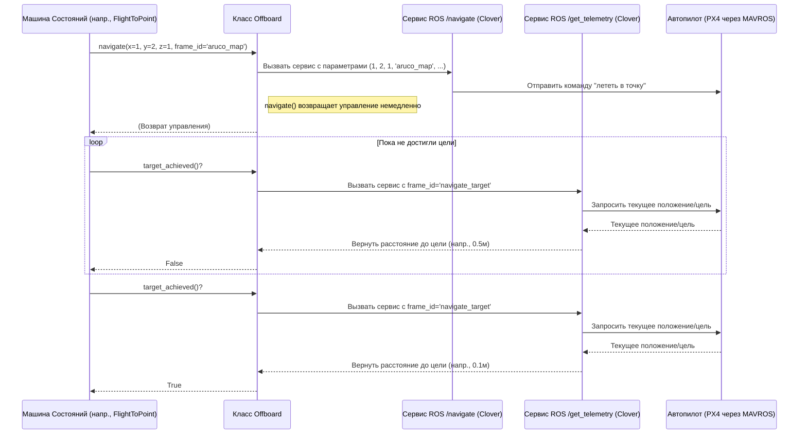

# Chapter 4: Абстракция управления дроном (Offboard)


В [предыдущей главе](03_обработка_видеопотока_и_обнаружение_объектов_.md) мы узнали, как дрон использует свое "зрение" ([Обработка видеопотока и обнаружение объектов](03_обработка_видеопотока_и_обнаружение_объектов_.md)) для поиска цветных маркеров на карте. Мы также разобрались, как [Машина состояний миссии](02_машина_состояний_миссии_.md) решает, *что* дрону нужно делать в каждый момент времени (взлететь, лететь к точке, обходить территорию). Но остался важный вопрос: *как именно* дрон выполняет эти команды? Как он физически перемещается из точки А в точку Б?

За это отвечает компонент, который мы рассмотрим в этой главе – **Абстракция управления дроном**, реализованная в классе `Offboard`.

**Зачем нужна эта абстракция? Простой пульт для сложного дрона**

Представьте, что у вас есть очень продвинутый дрон. Чтобы заставить его просто взлететь, вам, возможно, пришлось бы отправить несколько низкоуровневых команд через систему ROS (Robot Operating System), используя специфические протоколы вроде MAVLink и сервисы MAVROS или специализированные сервисы платформы Clover. Это может быть сложно, особенно для новичка. Нужно знать точные имена сервисов, типы сообщений, параметры...

Класс `Offboard` решает эту проблему. Он работает как **упрощенный пульт дистанционного управления** для нашего дрона. Вместо того чтобы разбираться во всей "внутренней электронике" управления полетом, вы получаете несколько простых "кнопок" (методов):

*   `takeoff()` (или `nonblock_takeoff()`): Взлететь.
*   `navigate(x, y, z)`: Лететь в точку с координатами (x, y, z).
*   `land()`: Приземлиться.
*   `disarm()`: Выключить моторы (для безопасности).
*   `target_achieved()`: Проверить, долетел ли дрон до цели.

**Основная задача класса `Offboard` – скрыть сложность прямого взаимодействия с ROS-сервисами и предоставить понятный интерфейс для управления основными маневрами дрона.**

**Как использовать `Offboard`? (Примеры из Машины состояний)**

Вспомним нашу [Машину состояний миссии](02_машина_состояний_миссии_.md). Разные состояния (`Takeoff`, `FlightToPoint`, `Land`) используют объект `Offboard` (который хранится в `self.machine.offboard`), чтобы отдавать команды дрону.

**1. Взлет (`Takeoff`)**

Состояние `Takeoff` должно поднять дрон в воздух. Оно использует метод `nonblock_takeoff()` и затем `target_achieved()`.

```python
# --- Файл: offboard/scripts/main.py (упрощено) ---
class Takeoff(IState):
    def initialise(self):
        # Отдаем команду взлететь (не ждем завершения)
        self.machine.offboard.nonblock_takeoff()
        print("Начинаем взлет...")
        return super().initialise() # Завершаем инициализацию

    def transition(self):
        # Проверяем, достиг ли дрон нужной высоты (завершил ли взлет)
        if self.machine.offboard.target_achieved():
            print("Взлет завершен!")
            return super().transition() # Переходим к следующему состоянию
        # Если еще не взлетел, остаемся в этом состоянии
        return self
```

*Объяснение:*
*   `nonblock_takeoff()`: Эта команда *не блокирующая*. Она просто говорит дрону "начинай взлетать" и сразу же возвращает управление, позволяя машине состояний работать дальше.
*   `target_achieved()`: В методе `transition` мы *периодически* проверяем, достиг ли дрон целевой точки (в данном случае, стандартной высоты взлета). Как только `target_achieved()` возвращает `True`, состояние `Takeoff` завершается.

**2. Полет к точке (`FlightToPoint`)**

Это состояние направляет дрон к заданным координатам (x, y, z) на карте `aruco_map`.

```python
# --- Файл: offboard/scripts/main.py (упрощено) ---
class FlightToPoint(IState):
    def __init__(self, machine, x: float, y: float, z: float = None, speed: float = 0.25):
        super().__init__(machine)
        self.__x = x
        self.__y = y
        self.__z = z # Если z=None, используется высота по умолчанию из Offboard
        self.__speed = speed # Скорость полета
            
    def initialise(self):
        # Отдаем команду лететь к точке (не блокирующая)
        # Используем систему координат 'aruco_map'
        self.machine.offboard.navigate(x=self.__x, y=self.__y, z=self.__z,
                                      frame_id='aruco_map', speed=self.__speed)
        print(f"Летим к точке ({self.__x:.1f}, {self.__y:.1f})...")
        return super().initialise()

    def transition(self):
        # Проверяем, достигли ли точки
        if self.machine.offboard.target_achieved():
            print(f"Достигли точки ({self.__x:.1f}, {self.__y:.1f})!")
            return super().transition() # Переходим к следующему состоянию
        # Если еще летим, остаемся в этом состоянии
        return self
```

*Объяснение:*
*   `navigate(x, y, z, frame_id, speed)`: Это тоже *не блокирующая* команда. Она отправляет дрону цель (x, y, z) в указанной системе координат (`aruco_map`) и с заданной скоростью.
*   `target_achieved()`: Опять же, мы используем эту функцию в `transition`, чтобы узнать, когда дрон долетел до пункта назначения.

**3. Посадка (`Land`)**

Состояние `Land` инициирует посадку.

```python
# --- Файл: offboard/scripts/main.py (упрощено) ---
class Land(IState):
    def __init__(self, machine):
        super().__init__(machine)

    def initialise(self):
        # Ничего не делаем при входе (команда дается в transition)
        return super().initialise()

    def transition(self):
        # Отдаем команду на посадку
        print("Начинаем посадку...")
        self.machine.offboard.land()
        # После команды land() сразу переходим дальше
        # (Предполагается, что сама система Clover/PX4 управляет процессом посадки)
        return super().transition()
```

*Объяснение:*
*   `land()`: Эта команда инициирует процедуру посадки. В нашей реализации машина состояний не ждет фактического приземления, а сразу переходит к следующему шагу (или завершает миссию), доверяя управление посадкой автопилоту дрона.

**4. Обезоруживание (`Disarm`)**

Это состояние используется для выключения моторов после посадки или по команде.

```python
# --- Файл: offboard/scripts/main.py (упрощено) ---
class Disarm(IState):
    def __init__(self, machine):
        super().__init__(machine)

    def initialise(self):
        return super().initialise()

    def transition(self):
        # Отдаем команду выключить моторы
        print("Выключаем моторы...")
        self.machine.offboard.disarm()
        return super().transition() # Сразу переходим дальше
```

*Объяснение:*
*   `disarm()`: Отправляет команду на выключение моторов.

**Блокирующие vs Неблокирующие команды**

Вы могли заметить, что мы использовали `nonblock_takeoff()` и `navigate()` вместо `takeoff()` и `navigate_wait()`. В классе `Offboard` есть обе версии:

*   **Блокирующие (`takeoff`, `navigate_wait`):** Эти функции *ждут*, пока дрон не завершит действие (не взлетит или не долетит до точки), и только потом возвращают управление. Они проще в использовании для простых скриптов, но не подходят для машины состояний, так как она "замерзнет" на время выполнения команды.
*   **Неблокирующие (`nonblock_takeoff`, `navigate`):** Эти функции *не ждут* завершения. Они отправляют команду и сразу возвращаются. Это позволяет [Машине состояний миссии](02_машина_состояний_миссии_.md) продолжать работать (например, проверять другие условия, обрабатывать команды паузы) во время полета. Для проверки завершения действия используется отдельный метод `target_achieved()`.

**Под капотом: Как `Offboard` общается с ROS**

Как же `Offboard` превращает простые вызовы типа `navigate(1, 2, 1)` в реальное движение дрона? Он использует **сервисы ROS**.

Представьте, что ROS – это почтовая служба для роботов. Сервисы – это как специальные запросы, которые можно отправить другому компоненту системы (называемому "сервер") и получить ответ. Платформа Clover (на которой основан наш дрон) предоставляет несколько таких сервисов для управления полетом.

Класс `Offboard` выступает как **клиент** для этих сервисов.

**Шаг за шагом: Выполнение `navigate(1, 2, 1)`**

1.  **Вызов метода:** [Машина состояний миссии](02_машина_состояний_миссии_.md) (например, состояние `FlightToPoint`) вызывает `self.machine.offboard.navigate(x=1, y=2, z=1, frame_id='aruco_map')`.
2.  **Подготовка запроса:** Метод `navigate` внутри класса `Offboard` формирует запрос к сервису ROS `/navigate` платформы Clover. Запрос содержит координаты (x=1, y=2, z=1), систему координат (`aruco_map`), скорость и другие параметры.
3.  **Вызов сервиса ROS:** `Offboard` использует специальный объект `rospy.ServiceProxy` (созданный при инициализации `Offboard`) для отправки этого запроса сервису `/navigate`.
4.  **Обработка сервером:** Сервер `/navigate` (часть ПО Clover) получает запрос. Он, в свою очередь, взаимодействует с MAVROS (компонент, связывающий ROS с полетным контроллером PX4), чтобы передать команду полета в нужную точку автопилоту дрона.
5.  **Возврат управления:** Так как `navigate` – неблокирующий метод, он *не ждет* ответа от сервиса (и тем более завершения полета). Он просто отправляет запрос и сразу возвращает управление машине состояний.
6.  **Проверка `target_achieved()`:** Позже, когда машина состояний вызывает `offboard.target_achieved()`, этот метод использует другой сервис ROS – `/get_telemetry` – с параметром `frame_id='navigate_target'`. Этот сервис возвращает текущее расстояние до цели. Метод `target_achieved()` проверяет, меньше ли это расстояние заданного допуска (например, 0.2 метра), и возвращает `True` или `False`.

**Диаграмма взаимодействия:**



**Взгляд на код `Offboard`**

Давайте посмотрим на упрощенные фрагменты кода класса `Offboard`, чтобы увидеть, как он использует сервисы ROS.

**1. Инициализация (`__init__`)**

Здесь создаются "клиенты" для нужных ROS-сервисов.

```python
# --- Файл: offboard/scripts/main.py или mission.py (упрощено) ---
import rospy
from clover import srv as clover_srv # Импортируем типы сервисов Clover
from std_srvs.srv import Trigger      # Стандартный сервис без параметров
from mavros_msgs.srv import CommandLong # Сервис MAVROS для общих команд

class Offboard(object):
    def __init__(self, flight_height) -> None:
        self.__flight_height = flight_height # Запоминаем высоту полета по умолчанию

        # Создаем "прокси" для вызова сервисов ROS
        # Мы указываем имя сервиса и его тип (описание запроса/ответа)
        self.__get_telemetry = rospy.ServiceProxy('get_telemetry', clover_srv.GetTelemetry)
        self.__navigate      = rospy.ServiceProxy('navigate', clover_srv.Navigate)
        self.__land          = rospy.ServiceProxy('land', Trigger)
        # Сервис для отправки команд MAVROS, используется для disarm
        self.__arming        = rospy.ServiceProxy('/mavros/cmd/command', CommandLong)
        print("Прокси для сервисов управления созданы.")

    # ... остальные методы ...
```

*Объяснение:*
*   `rospy.ServiceProxy(имя_сервиса, тип_сервиса)` создает объект, через который можно вызывать соответствующий ROS-сервис. Например, `self.__navigate(...)` будет вызывать сервис `/navigate` типа `clover_srv.Navigate`.

**2. Навигация (`navigate`)**

Метод, который отправляет команду полета к точке.

```python
# --- Файл: offboard/scripts/main.py или mission.py (упрощено) ---
class Offboard(object):
    # ... (__init__) ...

    def navigate(self,
                 x=0, y=0, z=None,
                 yaw=float('nan'), # Угол рыскания (NaN - не менять)
                 speed=0.25,
                 frame_id='body',  # Система координат ('body' или 'aruco_map')
                 auto_arm=False):  # Автоматически ли "вооружать" дрон (включать моторы)
        
        # Если высота Z не указана, используем высоту по умолчанию
        if z is None: z = self.__flight_height
        print(f'Летим к точке x={x:.1f}, y={y:.1f}, z={z:.1f} в {frame_id}. [Неблокирующий]')

        # Вызываем ROS-сервис /navigate через созданный прокси
        # Передаем все параметры как аргументы
        self.__navigate(x=x, y=y, z=z, yaw=yaw, speed=speed, frame_id=frame_id, auto_arm=auto_arm)
        # Важно: не ждем ответа или завершения полета

    # ... (target_achieved, land, disarm) ...
```

*Объяснение:*
*   Метод просто вызывает прокси-объект `self.__navigate`, передавая ему все необходимые параметры. Это и есть отправка запроса в ROS.

**3. Проверка достижения цели (`target_achieved`)**

Метод, который проверяет, долетел ли дрон.

```python
# --- Файл: offboard/scripts/main.py или mission.py (упрощено) ---
class Offboard(object):
    # ... (__init__, navigate) ...

    def target_achieved(self, tolerance=0.2): # Допуск в метрах
        assert tolerance >= 0.05 # Проверка разумности допуска

        # Вызываем сервис /get_telemetry с frame_id='navigate_target'
        # Этот специальный frame_id заставляет сервис вернуть вектор
        # от текущей позиции до текущей цели навигации.
        t = self.__get_telemetry(frame_id='navigate_target')

        # Вычисляем длину этого вектора (расстояние до цели)
        distance_to_target = (t.x**2 + t.y**2 + t.z**2)**0.5
        # print(f"Расстояние до цели: {distance_to_target:.2f} м") # Для отладки

        # Возвращаем True, если расстояние меньше допуска
        return distance_to_target <= tolerance

    # ... (land, disarm) ...
```

*Объяснение:*
*   Вызывается сервис `/get_telemetry` с особым `frame_id`.
*   Полученный результат (вектор до цели `t.x`, `t.y`, `t.z`) используется для вычисления расстояния.
*   Расстояние сравнивается с допуском `tolerance`.

**Заключение**

Класс `Offboard` – это важный "переводчик" между высокоуровневой логикой миссии ([Машина состояний миссии](02_машина_состояний_миссии_.md)) и низкоуровневыми командами управления дроном, доступными через ROS-сервисы Clover и MAVROS. Он предоставляет простые и понятные методы (`navigate`, `land`, `target_achieved` и т.д.), скрывая детали взаимодействия с ROS. Это значительно упрощает написание сценариев полета и делает код более читаемым и легким для понимания новичками.

Мы рассмотрели основные программные компоненты:
*   [Веб-панель управления](01_веб_панель_управления_.md) (интерфейс пользователя)
*   [Машина состояний миссии](02_машина_состояний_миссии_.md) (логика миссии)
*   [Обработка видеопотока и обнаружение объектов](03_обработка_видеопотока_и_обнаружение_объектов_.md) ("зрение" дрона)
*   Абстракция управления дроном (Offboard) (управление движением)

Теперь, когда мы понимаем, как работает программа дрона, в следующей главе, [Настройка среды и симуляции](05_настройка_среды_и_симуляции_.md), мы узнаем, как подготовить все необходимое для запуска нашего проекта – как в симуляции, так и на реальном дроне.

---

Generated by [AI Codebase Knowledge Builder](https://github.com/The-Pocket/Tutorial-Codebase-Knowledge)