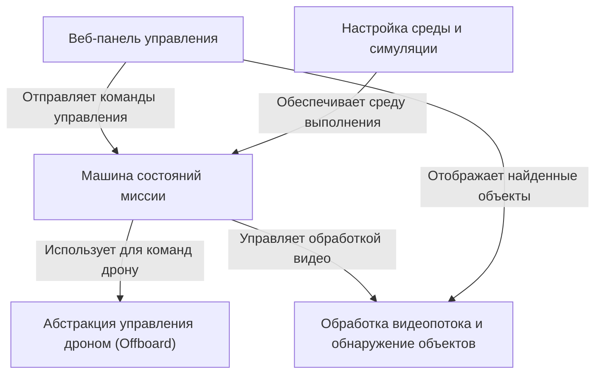

# Tutorial: fr-team-task-rozen

Этот проект представляет собой систему управления **автономным полетом дрона** для *осмотра территории* и *обнаружения объектов* (цветных маркеров, имитирующих здания).
Система включает **машину состояний** для управления логикой миссии (взлет, полет по маршруту, посадка), **веб-интерфейс** для мониторинга (статус, карта объектов) и отправки команд (старт, стоп, пауза), модуль **компьютерного зрения** для анализа видеопотока с камеры и средства для **настройки симуляции** в Docker и Gazebo.

**Source Repository:** [None](None)

## Chapters

1. [Веб-панель управления
](01_веб_панель_управления_.md)
2. [Машина состояний миссии
](02_машина_состояний_миссии_.md)
3. [Обработка видеопотока и обнаружение объектов
](03_обработка_видеопотока_и_обнаружение_объектов_.md)
4. [Абстракция управления дроном (Offboard)
](04_абстракция_управления_дроном__offboard__.md)
5. [Настройка среды и симуляции
](05_настройка_среды_и_симуляции_.md)

---

Generated by [AI Codebase Knowledge Builder](https://github.com/The-Pocket/Tutorial-Codebase-Knowledge)